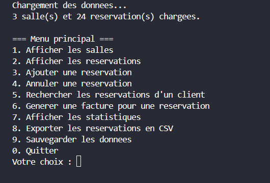
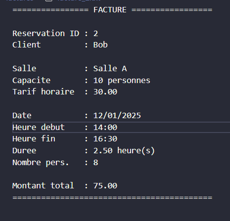

# 🏢 Système de Gestion de Réservations de Salles

### Projet de Programmation C Avancée — 2025

**Auteurs :** 
- Yassine Dammak
- Syrine Borchani  
- Mohamed Amin Siala
  
**Langage :** C (C11), GCC  
**Architecture :** Modulaire (fichiers `.c` + `.h`), interface en mode texte  
**Persistance :** Fichiers texte (`.cfg`, `.dat`, `.csv`) et génération de fichiers factures `.txt`

---

## 📌 1. Introduction

Ce projet implémente un **système complet de gestion de réservations de salles**, destiné aux petites entreprises et espaces de coworking.

L'application est entièrement développée en **langage C** et propose :

- Une interface en mode terminal,
- Une architecture modulaire (fichiers `.c` / `.h`),
- Une gestion avancée des réservations,
- Un système de facturation automatique,
- Des statistiques d'utilisation,
- Une persistance complète des données dans des fichiers.

Ce travail couvre les compétences exigées dans le module *Programmation C avancée* : gestion mémoire, manipulation de fichiers, modularité, contrôles d’erreurs et conception propre.

---

## ▶ 2. Compilation et exécution

### 🔧 Compilation

Depuis un terminal, placez-vous dans le dossier du projet :

```bash
cd projet_C
````

Compilez l’ensemble des fichiers sources :

```bash
gcc main.c menu.c reservation.c salle.c facture.c stats.c persistence.c utils.c -o reservations.exe
```

Si la compilation réussit, un exécutable nommé **`reservations.exe`** sera généré.


### ▶ Exécution

Lancer le programme :

```bash
./reservations.exe
```

Le système charge automatiquement les salles et réservations stockées dans le dossier `data/`.

---

## 📊 3. Menu principal

Une fois le programme lancé, l’utilisateur accède au **menu principal** :



---

## 🧱 4. Fonctionnalités principales

### ✔ Gestion des salles

* Chargement depuis `data/salles.cfg`
* Affichage de la capacité, du tarif horaire et des équipements

### ✔ Gestion des réservations

* Ajout avec :

  * vérification de disponibilité (pas de chevauchement)
  * vérification de capacité
  * cohérence des horaires
* Calcul automatique du tarif
* Annulation de réservation
* Recherche par nom de client
* Affichage complet

### ✔ Facturation automatique

* Génération d’un fichier `.txt` dans `data/factures/`
* Détails affichés : client, salle, date, heures, durée, tarif horaire, montant total.

### ✔ Statistiques

* Salles les plus utilisées
* Nombre de réservations par mois
* Chiffre d’affaires par salle

### ✔ Persistance

* Chargement automatique au démarrage
* Sauvegarde après chaque modification
* Fichiers utilisés :

  * `reservations.dat`
  * `salles.cfg`
  * `reservations_export.csv`

### ✔ Fonctionnalités avancées

* Statuts : `EN_ATTENTE`, `CONFIRME`, `ANNULE`
* Export CSV pour traitement externe

---

## 🧾 5. Exemple de facture générée

Lorsqu'une facture est générée, le programme produit un fichier dans `data/factures/`:



---

## 🧪 6. Exemple de fichier salles (`data/salles.cfg`)

```text
# id;nom;capacite;tarif_horaire;equipements
1;Salle A;10;30.0;Projecteur, Wi-Fi
2;Salle B;20;45.5;TV, Tableau blanc
3;Salle C;5;15.0;Salle pour petites réunions
```
---


## 🧪 7. Données de test (`data/reservations.dat`)

Un fichier riche contenant **24 réservations** est fourni pour tester :

* plusieurs salles
* différentes durées et dates
* différents statuts
* l’analyse statistique
* la facturation

---

## 🎯 8. Conclusion

Ce projet constitue une **application complète**, structurée et robuste en langage C.
Il couvre l’ensemble des aspects requis : modularité, gestion mémoire, fichiers, structures avancées, vérifications, statuts, statistiques, facturation.
